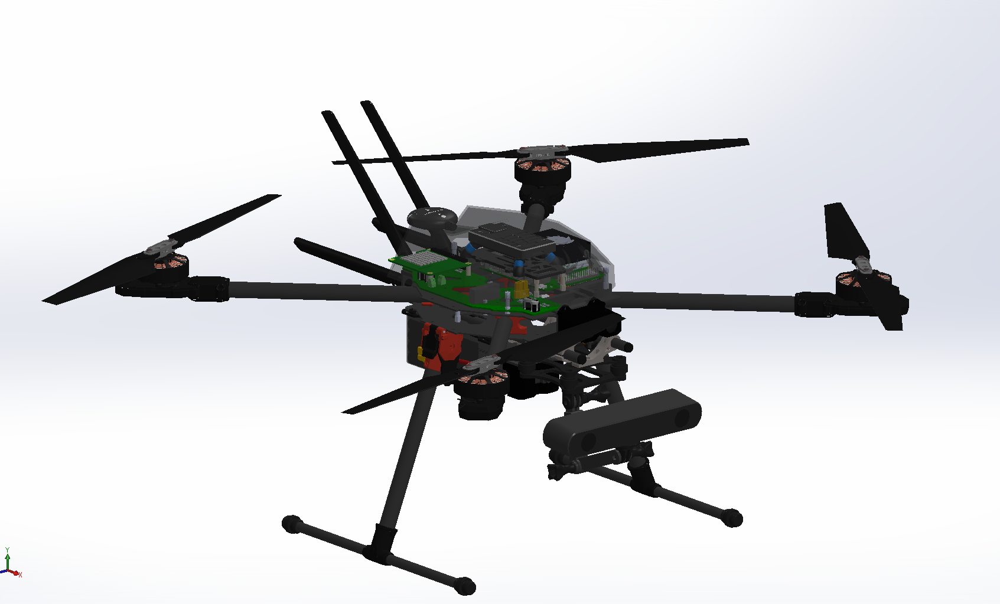

# Pegasus Hardware

This repo contains CAD files, STLs and hardware specs for the Pegasus Drone.

The virtual CAD model was made in Solidworks 2019 Edu Edition. Open `Pegasus_Drone.SLDASM`.

Visit [my Thingiverse page](https://www.thingiverse.com/mihirpatel/designs) for STLs.

